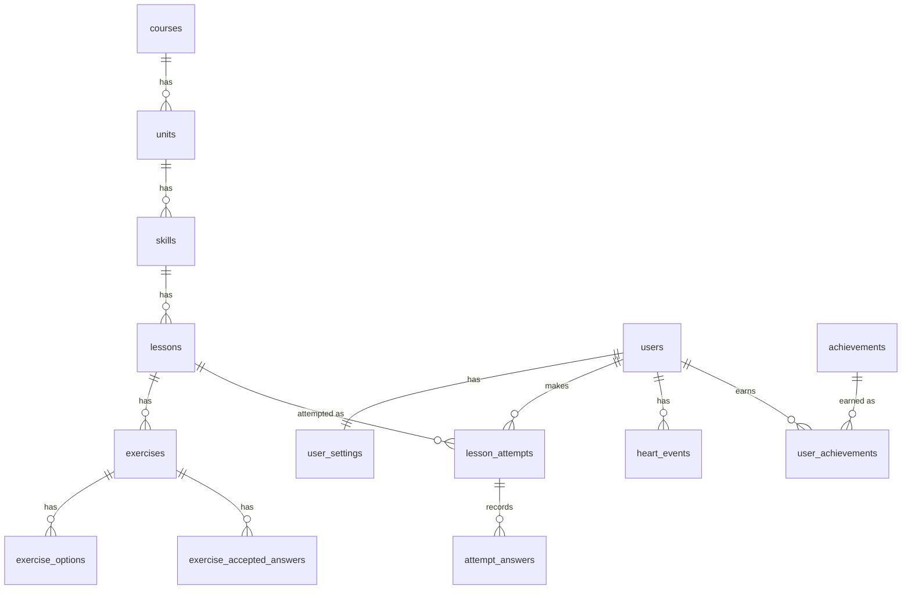

# Duolingo Clone

A full-stack clone of the Duolingo web app. A learner walks a skill path, completes lessons made of five exercise types, earns XP, keeps a streak, loses and regains hearts, and climbs a weekly leaderboard. All progress is stored in SQLite and persists per learner.

The seeded course is **Spanish for English speakers** (2 units, 8 skills). It is deliberately small, because the focus is the lesson loop and the gamification rules.

> **Live demo:** _add deployed URL_  ·  **Repository:** _add GitHub URL_

## Documentation map

| Document | Read it for |
| --- | --- |
| This file | Overview, quick start, architecture, schema summary |
| [`frontend/README.md`](frontend/README.md) | Next.js app: pages, components, API client, styling |
| [`backend/README.md`](backend/README.md) | FastAPI service: `/api` and `/compat` contracts, business rules, config, tests |
| [`backend/SCHEMA_DESIGN_FINAL.md`](backend/SCHEMA_DESIGN_FINAL.md) | Full database design: every table, constraint, index and design decision |

## Tech stack

| Layer | Technology |
| --- | --- |
| Frontend | Next.js 15 (App Router), React 19, TypeScript, Tailwind CSS 3, Framer Motion |
| Backend | Python 3.11+, FastAPI, SQLAlchemy 2.0, Pydantic 2 |
| Database | SQLite (15 tables, foreign keys enforced) |
| Tests | pytest + httpx (backend) |

## Features

- **Learning path:** units and skills with locked, available and completed states, progress rings, treasure chests and practice nodes.
- **Lesson player:** multiple choice, translate (word bank), match pairs, fill in the blank and type-the-answer. It has a feedback bar, a progress bar, text-to-speech, and out-of-hearts and lesson-complete modals.
- **Gamification:** XP, daily streak, hearts that regenerate over time or refill with gems, a daily XP goal, a weekly leaderboard with seeded rivals, and Legendary replay challenges.
- **Learner pages:** profile with stats, quests, shop, guidebook per unit and settings.
- **Testable time:** a simulated clock lets you advance days to check streaks and heart regeneration without waiting.

Speech recognition, real payments, friends and multiple languages are placeholders, and the UI marks them "Coming soon". Authentication is simplified: a single seeded learner (`learner`) is always signed in.

## Quick start

You need **Python 3.11+** and **Node.js 18.18+** (20+ recommended). Run the backend and frontend in two terminals.

**1. Backend** (http://localhost:8000)

```bash
cd backend
python -m venv .venv
source .venv/bin/activate          # Windows: .venv\Scripts\activate
pip install -r requirements-dev.txt
python -m app.seed                 # creates duolingo.db and seeds it (safe to re-run)
uvicorn app.main:app --reload
```

**2. Frontend** (http://localhost:3000)

```bash
cd frontend
npm install
npm run dev
```

Open http://localhost:3000. It redirects to `/learn`. The API docs are at http://localhost:8000/docs.

The frontend calls `http://localhost:8000/compat` by default. To point it elsewhere, set `NEXT_PUBLIC_API_URL`. See the [frontend README](frontend/README.md#configuration).

## Architecture

```
Browser ──► Next.js (frontend/) ──fetch──► FastAPI (backend/) ──SQLAlchemy──► SQLite
              pages, components            routers → services → models         duolingo.db
              lib/api.ts                   /compat/api/...  (used by the UI)
                                           /api/...         (native, server-graded)
```

- The **frontend** is a client-rendered Next.js app. The server owns all game state and rules (XP, hearts, streak, unlocks). The browser only renders and sends results.
- The **backend** uses a thin-router design: routers handle HTTP, services hold the business rules, and models define the schema.
- The backend exposes **two API surfaces over the same services and database**:
  - `/api` is the native contract. It hides answers and grades each answer on the server.
  - `/compat` is a UI adapter. It returns the shapes the Duolingo-style frontend needs, with local answer checking in the browser.
  - Details are in [`backend/README.md`](backend/README.md#api-and-compat-two-api-surfaces).

## Database schema (summary)

The database has **15 tables**, split into shared course content and per-learner state.



| Group | Tables |
| --- | --- |
| Content | `courses`, `units`, `skills`, `lessons`, `exercises`, `exercise_options`, `exercise_accepted_answers` |
| Learner state | `users`, `user_settings`, `lesson_attempts`, `attempt_answers`, `heart_events` |
| Gamification and system | `achievements`, `user_achievements`, `system_settings` |

Key design decisions:

- **XP, streak, hearts, crowns and the leaderboard are derived, not stored.** They are computed from `lesson_attempts` and `heart_events`, so they can't drift out of sync.
- **A few facts are stored on purpose** because they are history or mutable state: `lesson_attempts.xp_earned`, `attempt_answers.is_correct`, `users.gems` and `user_achievements`.
- **Exercises are relational** (options and accepted answers are rows, not JSON), so they stay queryable and constrained.
- **Integrity is enforced in the database** with foreign keys, explicit delete behaviour, unique and check constraints, and indexes.

The complete design is in [`backend/SCHEMA_DESIGN_FINAL.md`](backend/SCHEMA_DESIGN_FINAL.md).

## Seeded data

`python -m app.seed` creates:

- the Spanish course: 2 units, 8 skills (4 lesson skills with 2 lessons each, 2 treasure chests, 2 practice nodes);
- 40 exercises: 8 of each of the five types;
- a default learner (`learner`) with 110 XP, a 3-day streak and 4 hearts;
- 10 leaderboard rivals (`bot1`–`bot10`) and 6 achievement definitions.

## Assumptions

- A single default learner is always signed in. There is no login or signup, and the identity lives in one replaceable dependency (`get_current_user`).
- Course content is seeded, not authored at runtime.
- Gems are a mocked currency, and the shop and refill flows are simplified.
- Timestamps are naive UTC, shifted by a simulated day offset for testing.
- The leaderboard is a weekly ranking of the learner against seeded bots.

## Project layout

```
duolingo-clone-main/
├── backend/    FastAPI app, models, services, seed, tests, schema document
├── frontend/   Next.js app (App Router)
├── LICENSE     MIT
└── README.md   this file
```

## License

[MIT](LICENSE)
