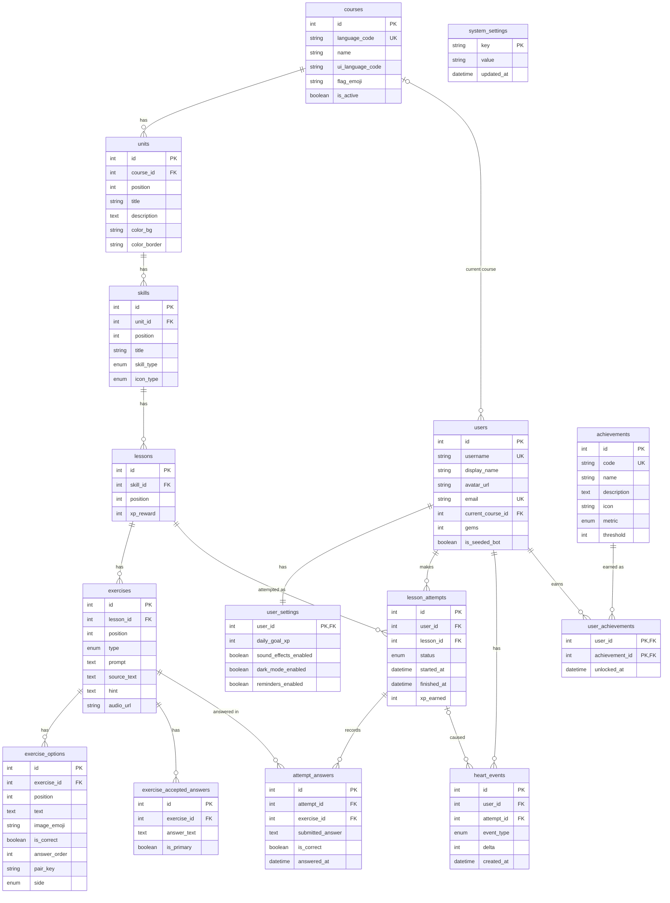

# Duolingo Clone: Database Schema Design

## 1. Overview

### 1.1 Purpose and Scope

The Duolingo Clone database stores course structure, exercises, learner activity, gamification events, achievements, and application settings required by the application.

The database supports:

- Course and language content
- Units, skills, lessons, and exercises
- Multiple exercise types
- Per-user lesson attempts and submitted answers
- XP calculation
- Streak calculation
- Heart tracking and regeneration
- Daily XP goals
- Achievements
- Leaderboard data
- Seeded demonstration users
- Testable and simulated day progression

The design separates shared course content from learner-specific state.

### 1.2 Technology

- SQLite
- SQLAlchemy 2.0
- FastAPI

SQLite foreign-key enforcement is enabled for database connections.

### 1.3 Design Goals and Principles

The schema follows these principles:

1. Keep shared course content normalized and reusable.
2. Keep learner-specific information separate from shared content.
3. Avoid storing values that can reliably be derived from recorded events.
4. Use foreign keys to preserve referential integrity.
5. Use explicit `CASCADE`, `RESTRICT`, and `SET NULL` deletion behavior.
6. Use unique and check constraints to prevent invalid data.
7. Add indexes for frequently executed queries.
8. Store timestamps for historical events.
9. Keep seed data deterministic and idempotent.
10. Make date-dependent behavior testable through a simulated clock.

### 1.4 How to Read This Document

The document starts with the overall schema and ER diagram and then describes individual tables, relationships, constraints, indexes, timestamps, seed data, and requirement traceability.

---

## 2. Schema at a Glance

### 2.1 ER Diagram

The database contains exactly 15 tables divided into three logical groups.

**Content**

- `courses`
- `units`
- `skills`
- `lessons`
- `exercises`
- `exercise_options`
- `exercise_accepted_answers`

**Learner State**

- `users`
- `user_settings`
- `lesson_attempts`
- `attempt_answers`
- `heart_events`

**Gamification and System**

- `achievements`
- `user_achievements`
- `system_settings`



### 2.2 Table Inventory

| Group | Table | Purpose |
|---|---|---|
| Content | `courses` | Stores available language courses |
| Content | `units` | Organizes a course into ordered units |
| Content | `skills` | Stores skills inside units |
| Content | `lessons` | Stores lessons belonging to skills |
| Content | `exercises` | Stores individual lesson exercises |
| Content | `exercise_options` | Stores selectable and structured exercise options |
| Content | `exercise_accepted_answers` | Stores accepted typed or translated answers |
| Learner | `users` | Stores learner profiles |
| Learner | `user_settings` | Stores learner preferences and daily XP goal |
| Learner | `lesson_attempts` | Records lesson runs and completion events |
| Learner | `attempt_answers` | Records answers submitted during attempts |
| Learner | `heart_events` | Records changes to learner hearts |
| Gamification | `achievements` | Defines available achievements |
| Gamification | `user_achievements` | Records achievements earned by users |
| System | `system_settings` | Stores application-level settings |

---

## 3. Content vs User-State Separation

### 3.1 Content Tables

The following tables contain shared course content:

- `courses`
- `units`
- `skills`
- `lessons`
- `exercises`
- `exercise_options`
- `exercise_accepted_answers`

This information is common to all learners. For example, the Spanish course and its lessons are not duplicated for every user.

Content is primarily created through the seed process and treated as read-only during normal learner interaction.

### 3.2 Learner-State Tables

The following tables contain information that changes based on learner activity:

- `users`
- `user_settings`
- `lesson_attempts`
- `attempt_answers`
- `heart_events`

Achievement ownership is part of the gamification layer:

- `user_achievements`

`user_achievements` is therefore consistently documented under **Gamification**, rather than under learner-state tables.

### 3.3 Why the Split Matters

Separating content from learner state provides several benefits:

- Multiple users can use the same course content.
- Course data does not need to be duplicated.
- Learner progress remains independent.
- Seed data can be recreated without mixing it with learner history.
- The design can support additional users and courses later.

---

## 4. Naming Conventions

### 4.1 Tables and Columns

Tables use plural `snake_case` names.

Examples:

```text
courses
lesson_attempts
exercise_options
user_achievements
```

Columns use singular `snake_case` names.

Examples:

```text
course_id
lesson_id
created_at
xp_earned
```

### 4.2 Primary and Foreign Keys

Most tables use an `id` column as their primary key.

Foreign keys use the referenced table name followed by `_id`.

Examples:

```text
course_id
unit_id
skill_id
lesson_id
exercise_id
user_id
attempt_id
```

Composite keys are used where the relationship itself uniquely identifies a record.

Example:

```text
user_achievements
PRIMARY KEY (user_id, achievement_id)
```

### 4.3 Booleans, Dates, and Enums

Boolean columns use descriptive names such as:

```text
is_seeded_bot
sound_effects_enabled
dark_mode_enabled
reminders_enabled
```

Date/time columns use names such as:

```text
created_at
updated_at
started_at
finished_at
answered_at
```

Fixed-value fields use enums where appropriate.

---

## 5. Tables and Primary Keys

### 5.1 Content Tables

#### 5.1.1 `courses`

**Purpose:** Stores a language course.

| Column | Type | Key | Notes |
|---|---|---|---|
| `id` | INTEGER | PK | Course identifier |
| `language_code` | VARCHAR | UNIQUE | Language/course code |
| `name` | VARCHAR | — | Course name |
| `ui_language_code` | VARCHAR | — | Interface language code |
| `flag_emoji` | VARCHAR | — | Course flag representation |
| `is_active` | BOOLEAN | — | Whether the course is active |

Constraint:

```text
UNIQUE(language_code)
```

---

#### 5.1.2 `units`

**Purpose:** Groups skills into ordered course units.

| Column | Type | Key | Notes |
|---|---|---|---|
| `id` | INTEGER | PK | Unit identifier |
| `course_id` | INTEGER | FK | References `courses.id` |
| `position` | INTEGER | — | Unit order |
| `title` | VARCHAR | — | Unit title |
| `description` | TEXT | — | Unit description |
| `color_bg` | VARCHAR | — | Unit background color |
| `color_border` | VARCHAR | — | Unit border color |

Constraints:

```text
UNIQUE(course_id, position)
CHECK(position >= 1)
```

---

#### 5.1.3 `skills`

**Purpose:** Represents individual learning skills inside a unit.

| Column | Type | Key | Notes |
|---|---|---|---|
| `id` | INTEGER | PK | Skill identifier |
| `unit_id` | INTEGER | FK | References `units.id` |
| `position` | INTEGER | — | Skill order |
| `title` | VARCHAR | — | Skill title |
| `icon_type` | ENUM | — | Skill icon |
| `skill_type` | ENUM | — | Skill category |

The schema does **not** contain a `description` column on `skills`.

Constraints:

```text
UNIQUE(unit_id, position)
CHECK(position >= 1)
```

---

#### 5.1.4 `lessons`

**Purpose:** Stores lessons belonging to a skill.

| Column | Type | Key | Notes |
|---|---|---|---|
| `id` | INTEGER | PK | Lesson identifier |
| `skill_id` | INTEGER | FK | References `skills.id` |
| `position` | INTEGER | — | Lesson order |
| `xp_reward` | INTEGER | — | XP awarded for completion |

Constraints:

```text
UNIQUE(skill_id, position)
CHECK(position >= 1)
CHECK(xp_reward >= 0)
```

---

#### 5.1.5 `exercises`

**Purpose:** Stores individual questions/exercises within lessons.

| Column | Type | Key | Notes |
|---|---|---|---|
| `id` | INTEGER | PK | Exercise identifier |
| `lesson_id` | INTEGER | FK | References `lessons.id` |
| `position` | INTEGER | — | Exercise order |
| `type` | ENUM | — | Exercise type |
| `prompt` | TEXT | — | Exercise question |
| `source_text` | TEXT | NULL | Source sentence/text |
| `hint` | TEXT | NULL | Optional hint |
| `audio_url` | VARCHAR | NULL | Optional audio |

Constraints:

```text
UNIQUE(lesson_id, position)
CHECK(position >= 1)
```

Supported exercise types:

```text
MULTIPLE_CHOICE
TRANSLATE_WORD_BANK
MATCH_PAIRS
FILL_IN_BLANK
TYPE_ANSWER
```

---

#### 5.1.6 `exercise_options`

**Purpose:** Stores selectable or structured options for exercises.

| Column | Type | Key | Notes |
|---|---|---|---|
| `id` | INTEGER | PK | Option identifier |
| `exercise_id` | INTEGER | FK | References `exercises.id` |
| `text` | TEXT | — | Option text |
| `image_emoji` | VARCHAR | NULL | Optional visual representation |
| `position` | INTEGER | — | Option order |
| `is_correct` | BOOLEAN | — | Correctness for relevant exercise types |
| `answer_order` | INTEGER | NULL | Correct word-bank order |
| `pair_key` | VARCHAR | NULL | Pair identifier for matching |
| `side` | ENUM | NULL | LEFT or RIGHT for matching |

Constraints:

```text
UNIQUE(exercise_id, position)
CHECK(position >= 1)
CHECK(answer_order IS NULL OR answer_order >= 1)
CHECK(
    (pair_key IS NULL AND side IS NULL)
    OR
    (pair_key IS NOT NULL AND side IS NOT NULL)
)
```

The `position` check prevents invalid option ordering. The `answer_order` check applies when an option participates in a word-bank answer. The `pair_key` and `side` check ensures that matching-pair metadata is either completely absent or completely present.

---

#### 5.1.7 `exercise_accepted_answers`

**Purpose:** Stores one or more valid answers for typed or translated exercises.

| Column | Type | Key | Notes |
|---|---|---|---|
| `id` | INTEGER | PK | Answer identifier |
| `exercise_id` | INTEGER | FK | References `exercises.id` |
| `answer_text` | TEXT | — | Accepted answer |
| `is_primary` | BOOLEAN | — | Marks the primary accepted answer |

Constraint:

```text
UNIQUE(exercise_id, answer_text)
```

This allows multiple valid translations or typed answers for a single exercise.

---

### 5.2 Learner-State Tables

#### 5.2.1 `users`

**Purpose:** Stores learner profile information.

| Column | Type | Key | Notes |
|---|---|---|---|
| `id` | INTEGER | PK | User identifier |
| `username` | VARCHAR | UNIQUE | User identifier/name |
| `display_name` | VARCHAR | — | Display name |
| `avatar_url` | VARCHAR | NULL | Optional avatar |
| `email` | VARCHAR | UNIQUE, NULL | Optional email |
| `current_course_id` | INTEGER | FK, NULL | References `courses.id` |
| `gems` | INTEGER | — | Mocked currency balance |
| `is_seeded_bot` | BOOLEAN | — | Identifies leaderboard seed users |
| `created_at` | DATETIME | — | Creation timestamp |
| `updated_at` | DATETIME | — | Update timestamp |

Constraint:

```text
CHECK(gems >= 0)
```

The following calculated values are deliberately not stored as columns:

```text
total_xp
current_streak
hearts
```

They are derived from recorded events and application rules.

---

#### 5.2.2 `user_settings`

**Purpose:** Stores per-user settings.

| Column | Type | Key | Notes |
|---|---|---|---|
| `user_id` | INTEGER | PK, FK | References `users.id` |
| `daily_goal_xp` | INTEGER | — | Daily XP goal |
| `sound_effects_enabled` | BOOLEAN | — | Sound preference |
| `dark_mode_enabled` | BOOLEAN | — | Dark-mode preference |
| `reminders_enabled` | BOOLEAN | — | Reminder preference |
| `created_at` | DATETIME | — | Creation timestamp |
| `updated_at` | DATETIME | — | Update timestamp |

Constraint:

```text
CHECK(daily_goal_xp IN (10,20,30,50))
```

This table has a one-to-one relationship with `users`.

---

#### 5.2.3 `lesson_attempts`

**Purpose:** Records every learner lesson attempt.

| Column | Type | Key | Notes |
|---|---|---|---|
| `id` | INTEGER | PK | Attempt identifier |
| `user_id` | INTEGER | FK | References `users.id` |
| `lesson_id` | INTEGER | FK | References `lessons.id` |
| `status` | ENUM | — | Attempt state |
| `started_at` | DATETIME | — | Start timestamp |
| `finished_at` | DATETIME | NULL | Completion timestamp |
| `xp_earned` | INTEGER | — | XP recorded for completed attempt |

Supported statuses:

```text
IN_PROGRESS
COMPLETED
FAILED_NO_HEARTS
ABANDONED
```

Constraints include:

```text
CHECK(xp_earned >= 0)
```

and:

```text
CHECK((finished_at IS NULL) = (status = 'IN_PROGRESS'))
```

`lesson_attempts` does not have generic `created_at` or `updated_at` columns; its lifecycle is represented by `started_at` and `finished_at`.

---

#### 5.2.4 `attempt_answers`

**Purpose:** Records each answer submitted during a lesson attempt.

| Column | Type | Key | Notes |
|---|---|---|---|
| `id` | INTEGER | PK | Answer identifier |
| `attempt_id` | INTEGER | FK | References `lesson_attempts.id` |
| `exercise_id` | INTEGER | FK | References `exercises.id` |
| `submitted_answer` | TEXT | — | Learner's submitted answer |
| `is_correct` | BOOLEAN | — | Whether answer was correct |
| `answered_at` | DATETIME | — | Answer timestamp |

`attempt_answers` does not contain generic `created_at` or `updated_at` columns.

---

#### 5.2.5 `heart_events`

**Purpose:** Records changes to learner hearts.

| Column | Type | Key | Notes |
|---|---|---|---|
| `id` | INTEGER | PK | Event identifier |
| `user_id` | INTEGER | FK | References `users.id` |
| `attempt_id` | INTEGER | FK, NULL | Optional related attempt |
| `event_type` | ENUM | — | Heart event type |
| `delta` | INTEGER | — | Positive or negative change |
| `created_at` | DATETIME | — | Event timestamp |

Constraint:

```text
CHECK(delta != 0)
```

`heart_events` has `created_at` but does not have `updated_at`.

Heart state is derived by replaying heart events and applying the regeneration rule.

### 5.3 Gamification and System Tables

#### 5.3.1 `achievements`

**Purpose:** Defines available achievements.

| Column | Type | Key | Notes |
|---|---|---|---|
| `id` | INTEGER | PK | Achievement identifier |
| `code` | VARCHAR | UNIQUE | Machine-readable code |
| `name` | VARCHAR | — | Display name |
| `description` | TEXT | — | Achievement description |
| `icon` | VARCHAR | — | Achievement icon |
| `metric` | ENUM | — | Metric being measured |
| `threshold` | INTEGER | — | Required threshold |
| `created_at` | DATETIME | — | Creation timestamp |
| `updated_at` | DATETIME | — | Update timestamp |

Constraint:

```text
CHECK(threshold > 0)
```

---

#### 5.3.2 `user_achievements`

**Purpose:** Links users to achievements they have earned.

| Column | Type | Key | Notes |
|---|---|---|---|
| `user_id` | INTEGER | PK, FK | References `users.id` |
| `achievement_id` | INTEGER | PK, FK | References `achievements.id` |
| `unlocked_at` | DATETIME | — | Time achievement was earned |

Primary key:

```text
PRIMARY KEY (user_id, achievement_id)
```

This is the many-to-many relationship between users and achievements.

---

#### 5.3.3 `system_settings`

**Purpose:** Stores application-wide settings.

| Column | Type | Key | Notes |
|---|---|---|---|
| `key` | VARCHAR | PK | Setting name |
| `value` | VARCHAR | — | Setting value |
| `updated_at` | DATETIME | — | Last update timestamp |

One important setting is:

```text
time_offset_days
```

This allows the application to simulate future days when testing streaks and other date-dependent behavior.

---

## 6. Relationships and Foreign Keys

### 6.1 Relationship Summary

The primary content hierarchy is:

```text
COURSES
  |
  └── 1:N ── UNITS
                 |
                 └── 1:N ── SKILLS
                               |
                               └── 1:N ── LESSONS
                                             |
                                             └── 1:N ── EXERCISES
                                                           |
                                                           ├── 1:N ── EXERCISE_OPTIONS
                                                           |
                                                           └── 1:N ── EXERCISE_ACCEPTED_ANSWERS
```

Learner relationships are:

```text
COURSES
  |
  └── 1:N ── USERS
                |
                ├── 1:1 ── USER_SETTINGS
                |
                ├── 1:N ── LESSON_ATTEMPTS
                |              |
                |              └── 1:N ── ATTEMPT_ANSWERS
                |
                ├── 1:N ── HEART_EVENTS
                |
                └── 1:N ── USER_ACHIEVEMENTS
                               |
                               └── N:1 ── ACHIEVEMENTS
```

The critical attempt relationship is:

```text
LESSONS 1:N LESSON_ATTEMPTS
```

`lesson_attempts.lesson_id` references `lessons.id`. There is no direct `skills -> lesson_attempts` foreign key.

### 6.2 Delete Behavior Per Foreign Key

| Child table | Foreign key | Parent | Delete behavior | Reason |
|---|---|---|---|---|
| `units` | `course_id` | `courses` | CASCADE | Units belong to a course |
| `skills` | `unit_id` | `units` | CASCADE | Skills belong to a unit |
| `lessons` | `skill_id` | `skills` | CASCADE | Lessons belong to a skill |
| `exercises` | `lesson_id` | `lessons` | CASCADE | Exercises belong to a lesson |
| `exercise_options` | `exercise_id` | `exercises` | CASCADE | Options have no independent meaning |
| `exercise_accepted_answers` | `exercise_id` | `exercises` | CASCADE | Answers belong to an exercise |
| `users` | `current_course_id` | `courses` | SET NULL | User can remain without a selected course |
| `user_settings` | `user_id` | `users` | CASCADE | Settings belong exclusively to a user |
| `lesson_attempts` | `user_id` | `users` | CASCADE | Attempts belong to a user |
| `lesson_attempts` | `lesson_id` | `lessons` | RESTRICT | Preserves referenced lesson history |
| `attempt_answers` | `attempt_id` | `lesson_attempts` | CASCADE | Answers belong to an attempt |
| `attempt_answers` | `exercise_id` | `exercises` | RESTRICT | Preserves exercise references in answer history |
| `heart_events` | `user_id` | `users` | CASCADE | Events belong to a user |
| `heart_events` | `attempt_id` | `lesson_attempts` | SET NULL | Keeps heart history if attempt reference is removed |
| `user_achievements` | `user_id` | `users` | CASCADE | User-specific achievement link |
| `user_achievements` | `achievement_id` | `achievements` | RESTRICT | Prevents deleting a referenced achievement |

### 6.3 Many-to-Many Link Tables

Users and achievements form a many-to-many relationship.

A user can earn many achievements, and an achievement can be earned by many users.

The relationship is represented by:

```text
user_achievements
```

with:

```text
PRIMARY KEY (user_id, achievement_id)
```

---

## 7. Normalization

### 7.1 Normal Forms Applied

#### First Normal Form

Each field stores a single logical value rather than a repeating group.

For example, exercise options are separate rows rather than a comma-separated list.

#### Second Normal Form

Non-key attributes depend on the complete primary key.

The composite `user_achievements` table stores attributes belonging to the specific user-achievement relationship.

#### Third Normal Form

Non-key attributes depend on the key and not on unrelated non-key attributes.

For example, course information is stored in `courses` rather than duplicated in every unit.

### 7.2 Derived Data Policy

The database avoids storing values that can reliably be calculated from recorded events.

| Derived value | Source |
|---|---|
| Total XP | Completed `lesson_attempts.xp_earned` |
| Current streak | Dates of completed lesson attempts |
| XP for a day | Completed attempts grouped by date |
| Weekly XP | Completed attempts within current week |
| Hearts | `heart_events` plus regeneration rule |
| Skill completion | Completed attempts for lessons in a skill |
| Crowns | Number of completed lessons in a skill |
| Locked/unlocked progression | Skill/lesson order and completion state |
| Leaderboard | XP aggregation across users |

### 7.3 What Is Calculated and Where

#### Total XP

Calculated as the sum of `xp_earned` for completed lesson attempts.

#### Current Streak

Calculated from consecutive dates on which the learner completed a lesson.

#### Hearts

Calculated by replaying the heart-event ledger and applying regeneration based on elapsed time.

#### Skill Progress

Calculated using completed lesson attempts and the number of lessons belonging to a skill.

#### Crowns

```text
crowns = number of lessons completed in the skill
```

Crowns are not stored as a separate column.

#### Leaderboard

Calculated by aggregating completed-attempt XP for users and sorting the result.

### 7.4 Exercise Type Mapping

| Exercise type | Relational storage |
|---|---|
| Multiple choice | `exercises` + `exercise_options` |
| Translate word bank | `exercises` + `exercise_options` + accepted answers |
| Match pairs | `exercises` + `exercise_options` |
| Fill in blank | `exercises` + options/accepted answers |
| Type answer | `exercises` + `exercise_accepted_answers` |

### 7.5 Intentional Exceptions to the Derived-Data Rule

The schema avoids storing values that can be reliably recalculated, but a few stored values are intentional exceptions because they represent historical facts, mutable state, or explicit assignment requirements.

#### `attempt_answers.is_correct`

`is_correct` is recorded when the learner submits an answer.

It represents the result of answer evaluation at that point in time. Re-evaluating the answer later could produce a different result if exercise rules or accepted answers change.

#### `lesson_attempts.xp_earned`

`xp_earned` records the XP actually awarded for a completed lesson attempt.

It is intentionally stored so historical XP remains stable even if XP rules change in the future.

#### `users.gems`

`gems` represents the learner's current mocked currency balance.

Unlike XP, gems are treated as mutable application state for this assignment and do not have a separate transaction ledger. The database therefore stores the current balance directly.

#### `user_achievements`

`user_achievements` records the historical fact that a user earned an achievement and the time at which it was unlocked.

Although achievement eligibility can be calculated from other data, the fact that the achievement was awarded is persistent historical state and is intentionally stored.

### 7.6 Special Skill Types

#### TREASURE Skills

TREASURE skills represent a special reward interaction rather than a normal XP-producing lesson sequence.

When a treasure skill is claimed:

- A `lesson_attempts` record is created with status `COMPLETED`.
- The completed attempt awards `0` XP.
- The learner receives `30` gems.
- TREASURE completion therefore does not increase total XP.

The zero-XP completed attempt preserves the learner's completion history while keeping the reward separate from XP.

#### PRACTICE Skills

PRACTICE skills represent timed practice sessions.

A practice session is limited to `180` seconds.

The timed behavior is handled by application logic rather than by storing a separate practice-progress column in the database.

The skill type is represented by:

```text
skills.skill_type = PRACTICE
```

---

## 8. Unique Constraints

| Table | Unique constraint |
|---|---|
| `courses` | `language_code` |
| `units` | `(course_id, position)` |
| `skills` | `(unit_id, position)` |
| `lessons` | `(skill_id, position)` |
| `exercises` | `(lesson_id, position)` |
| `exercise_options` | `(exercise_id, position)` |
| `exercise_accepted_answers` | `(exercise_id, answer_text)` |
| `users` | `username` |
| `users` | `email` |
| `achievements` | `code` |
| `user_achievements` | `(user_id, achievement_id)` |

---

## 9. Check Constraints

| Table | Check constraint |
|---|---|
| `units` | `position >= 1` |
| `skills` | `position >= 1` |
| `lessons` | `position >= 1` |
| `lessons` | `xp_reward >= 0` |
| `exercises` | `position >= 1` |
| `exercise_options` | `position >= 1` |
| `exercise_options` | `answer_order IS NULL OR answer_order >= 1` |
| `exercise_options` | `pair_key` and `side` must both be set or both be NULL |
| `users` | `gems >= 0` |
| `user_settings` | `daily_goal_xp IN (10,20,30,50)` |
| `lesson_attempts` | `xp_earned >= 0` |
| `lesson_attempts` | `finished_at/status` consistency |
| `heart_events` | `delta != 0` |
| `achievements` | `threshold > 0` |

SQLAlchemy enum columns also generate database-level `CHECK` constraints for their allowed enum values when stored as non-native enums in SQLite. These checks protect the database from unsupported skill types, exercise types, attempt statuses, heart event types, achievement metrics, and option sides.

---

## 10. Enums

### 10.1 Enum List and Allowed Values

#### `SkillType`

```text
LESSON
TREASURE
PRACTICE
```

#### `SkillIcon`

```text
STAR
BOOK
DUMBBELL
TROPHY
TREASURE
FAST_FORWARD
```

#### `ExerciseType`

```text
MULTIPLE_CHOICE
TRANSLATE_WORD_BANK
MATCH_PAIRS
FILL_IN_BLANK
TYPE_ANSWER
```

#### `OptionSide`

```text
LEFT
RIGHT
```

#### `AttemptStatus`

```text
IN_PROGRESS
COMPLETED
FAILED_NO_HEARTS
ABANDONED
```

#### `HeartEventType`

```text
LOST
REFILLED_PRACTICE
REFILLED_GEMS
```

#### `AchievementMetric`

```text
STREAK_DAYS
TOTAL_XP
LESSONS_COMPLETED
PERFECT_LESSONS
```

### 10.2 Why Enums Are Used

Enums provide:

- Consistent values
- Protection against spelling differences
- Easier application logic
- Clear documentation
- Better data integrity

---

## 11. Indexes

### 11.1 Index List and Purpose

| Table | Index | Purpose |
|---|---|---|
| `units` | `course_id` | Find units belonging to a course |
| `skills` | `unit_id` | Find skills belonging to a unit |
| `lessons` | `skill_id` | Find lessons belonging to a skill |
| `exercises` | `lesson_id` | Find exercises belonging to a lesson |
| `exercise_options` | `exercise_id` | Find options belonging to an exercise |
| `exercise_accepted_answers` | `exercise_id` | Find accepted answers |
| `users` | `current_course_id` | Find users by selected course |
| `lesson_attempts` | `(user_id, status, finished_at)` | Query user progress and completed attempts |
| `lesson_attempts` | `lesson_id` | Find attempts for a lesson |
| `attempt_answers` | `attempt_id` | Find answers belonging to an attempt |
| `attempt_answers` | `exercise_id` | Find answers for an exercise |
| `heart_events` | `user_id` | Replay a user's heart ledger |
| `heart_events` | `attempt_id` | Find heart events associated with an attempt |
| `heart_events` | `created_at` | Process heart events chronologically |

### 11.2 Composite Index

```text
ix_lesson_attempts_user_status_finished
(user_id, status, finished_at)
```

on `lesson_attempts`.

This supports queries that retrieve attempts for a particular user while filtering by status and completion time.

### 11.3 Indexes Deliberately Not Added

Indexes are not added to every column automatically.

Additional indexes are avoided when:

- The column is rarely searched.
- The table is very small.
- An existing unique or composite index already covers the query.
- The index would provide little benefit while increasing write/storage cost.

---

## 12. Timestamps

### 12.1 Timestamp Columns

Timestamp columns are included only where they exist in the schema.

`courses`, `units`, `skills`, `lessons`, `exercises`,
`exercise_options`, `exercise_accepted_answers`:

```text
created_at
updated_at
```

`users`:

```text
created_at
updated_at
```

`user_settings`:

```text
created_at
updated_at
```

`lesson_attempts`:

```text
started_at
finished_at
```

`attempt_answers`:

```text
answered_at
```

`heart_events`:

```text
created_at
```

`achievements`:

```text
created_at
updated_at
```

`user_achievements`:

```text
unlocked_at
```

`system_settings`:

```text
updated_at
```

The ER diagram intentionally omits timestamp columns for readability.

### 12.2 Timezone and Simulated Clock

The application reads:

```text
system_settings.time_offset_days
```

to calculate a simulated current date.

Conceptually:

```text
simulated_now = real_utc_now + configured_day_offset
```

This makes streak and date-dependent behavior testable without waiting for real days to pass.

---

## 13. Seed Data

### 13.1 What Is Seeded

The seed script creates:

- Spanish course
- Course units
- Skills
- Lessons
- Exercises
- Exercise options
- Accepted answers
- Default learner
- Learner settings
- Learner lesson history
- Heart events
- Leaderboard users
- Achievements
- User achievement records
- System settings

Expected seeded learner state:

```text
Total XP: 110
Current streak: 3 days
Hearts: 4
```

These values are not stored as user columns. They are produced by seeded event history and application rules.

### 13.2 Idempotency

The seed script is designed to be safe to run repeatedly.

Running:

```bash
python -m app.seed
```

multiple times should not create duplicate seed content or duplicate natural-key records.

### 13.3 How to Run the Seed

From the backend directory:

```bash
python -m app.seed
```

For a clean database:

```bash
rm -f duolingo.db
python -m app.seed
```

Windows PowerShell:

```powershell
Remove-Item duolingo.db -ErrorAction SilentlyContinue
python -m app.seed
```

---

## 14. Documentation and Traceability

### 14.1 Requirement-to-Schema Matrix

| Assignment Requirement | Database Implementation |
|---|---|
| Course content stored in database | `courses`, `units`, `skills`, `lessons`, `exercises` |
| Units and skills path | `units`, `skills` |
| Ordered progression | `position` columns and unique constraints |
| Locked/available/completed progression | Derived from skill/lesson order and completed attempts |
| Progress rings | Completed lessons compared with lessons in a skill |
| Crowns/progression | Number of completed lessons in a skill |
| Streak | Completed lesson dates |
| XP | `lesson_attempts.xp_earned` |
| Hearts | `heart_events` |
| Gems | `users.gems` |
| Lesson exercises | `lessons`, `exercises` |
| Multiple choice | `exercise_options` |
| Translate word bank | `exercise_options`, accepted answers |
| Match pairs | `exercise_options.pair_key` and `side` |
| Fill in blank | `exercises`, options/accepted answers |
| Type answer | `exercise_accepted_answers` |
| Correct/incorrect feedback | `attempt_answers.is_correct` |
| Lesson progress | Exercise positions and recorded answers |
| Lesson completion | `lesson_attempts.status` |
| Lesson failure due to hearts | `lesson_attempts.status` |
| XP award | `lesson_attempts.xp_earned` |
| Daily activity | Completed attempt timestamps |
| Testable day logic | `system_settings.time_offset_days` |
| Leaderboard | Derived XP aggregation over users |
| Daily XP goal | `user_settings.daily_goal_xp` |
| Persistent learner state | User-linked event/state tables |
| Learner profile | `users` and derived statistics |
| Achievements | `achievements`, `user_achievements` |
| Settings | `user_settings` |
| Dark mode | `user_settings.dark_mode_enabled` |
| Audio bonus | `exercises.audio_url` |
| Seed learner | Seed script |
| Leaderboard seed users | `users.is_seeded_bot` |
| Mocked gems | `users.gems` |
| Simplified authentication | `users` without a full authentication schema |

### 14.2 Key Design Decisions and Trade-offs

#### Event-derived XP

XP totals are calculated from completed lesson attempts rather than stored as a user total.

**Benefit:** prevents duplicated XP values from becoming inconsistent.

#### Event-derived streak

Streak is calculated from completion dates.

**Benefit:** historical activity remains the source of truth.

#### Event-derived hearts

Hearts are reconstructed from the `heart_events` log and the regeneration rule.

**Benefit:** heart changes remain auditable.

#### Relational exercise storage

Exercise-specific information is represented through `exercise_options` and `exercise_accepted_answers` instead of a JSON blob.

**Benefit:** keeps the schema relational and queryable.

#### Recorded XP on attempts

`lesson_attempts.xp_earned` represents the XP awarded for that historical lesson completion.

Future changes to XP rules therefore do not rewrite historical XP.

#### Recorded answer correctness

`attempt_answers.is_correct` records the answer-evaluation result at submission time.

#### Mutable gem balance

`users.gems` stores the current mocked gem balance because gems are an explicit mutable state value for this assignment and no separate gem transaction ledger is required.

#### Achievement history

`user_achievements` records when an achievement was earned. The criteria may be based on derived statistics, but the award itself is persistent historical state.

### 14.3 Assumptions

The schema assumes:

1. The application uses simplified authentication.
2. The default learner is created by the seed process.
3. Course content is seeded rather than authored through runtime APIs.
4. Gems are mocked for the assignment.
5. The leaderboard can use seeded users.
6. Friends, payments, speech recognition, and real authentication are outside the required database scope.
7. The schema can support additional courses later.
8. Hearts have a maximum of five.
9. Heart regeneration is handled by application logic rather than a background database job.
10. Date-dependent behavior can be tested using the simulated clock.
11. TREASURE claims award 30 gems and create a completed attempt with 0 XP.
12. PRACTICE skills use a 180-second timed session.

### 14.4 Known Limitations and Future Extensions

Possible future extensions include:

- Full authentication and password/identity tables
- Friend relationships
- Shop and purchase history
- Additional course/language content
- Audio asset management
- Speech recognition data
- Subscription/payment records
- More detailed practice-session history
- Legendary challenge modes
- More detailed achievement history
- Production database migrations using Alembic
- Additional integrity rules considered but left to application logic: a CHECK linking `heart_events.delta` to `event_type`, a partial unique index limiting each user to one `IN_PROGRESS` attempt, a composite `(user_id, created_at)` index on `heart_events`, and a one-primary-answer-per-exercise rule.

These features are intentionally outside the current required schema.

---

## 15. Final Schema Summary

The final database contains exactly **15 tables**:

```text
CONTENT
├── courses
├── units
├── skills
├── lessons
├── exercises
├── exercise_options
└── exercise_accepted_answers

LEARNER STATE
├── users
├── user_settings
├── lesson_attempts
├── attempt_answers
└── heart_events

GAMIFICATION / SYSTEM
├── achievements
├── user_achievements
└── system_settings
```

The schema follows a normalized relational design, uses explicit foreign-key deletion behavior, records historical learner events, and derives XP, streak, hearts, progression, crowns, and leaderboard values from those events rather than duplicating calculated state.

Intentional stored exceptions are documented for:

- `attempt_answers.is_correct`
- `lesson_attempts.xp_earned`
- `users.gems`
- `user_achievements`

The ER diagram and this document together provide the complete schema documentation for the 15-table database.
